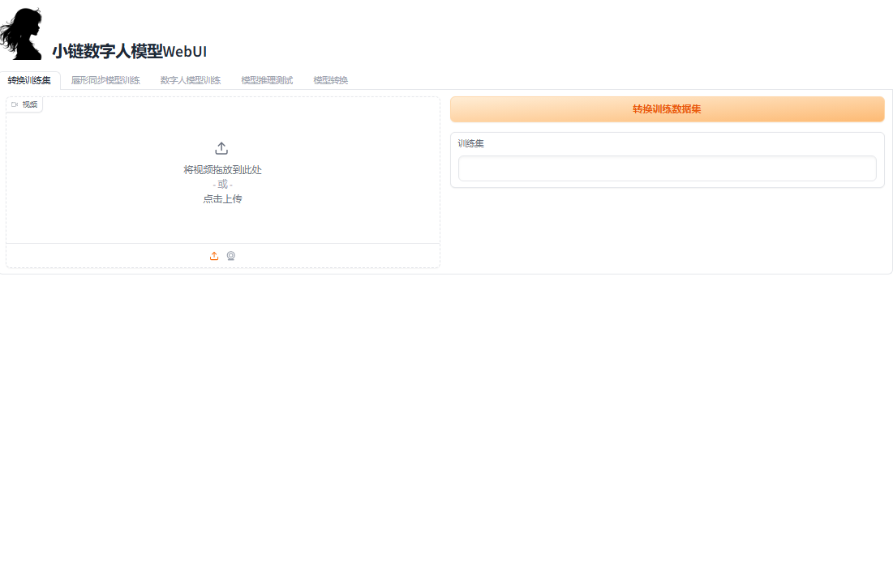
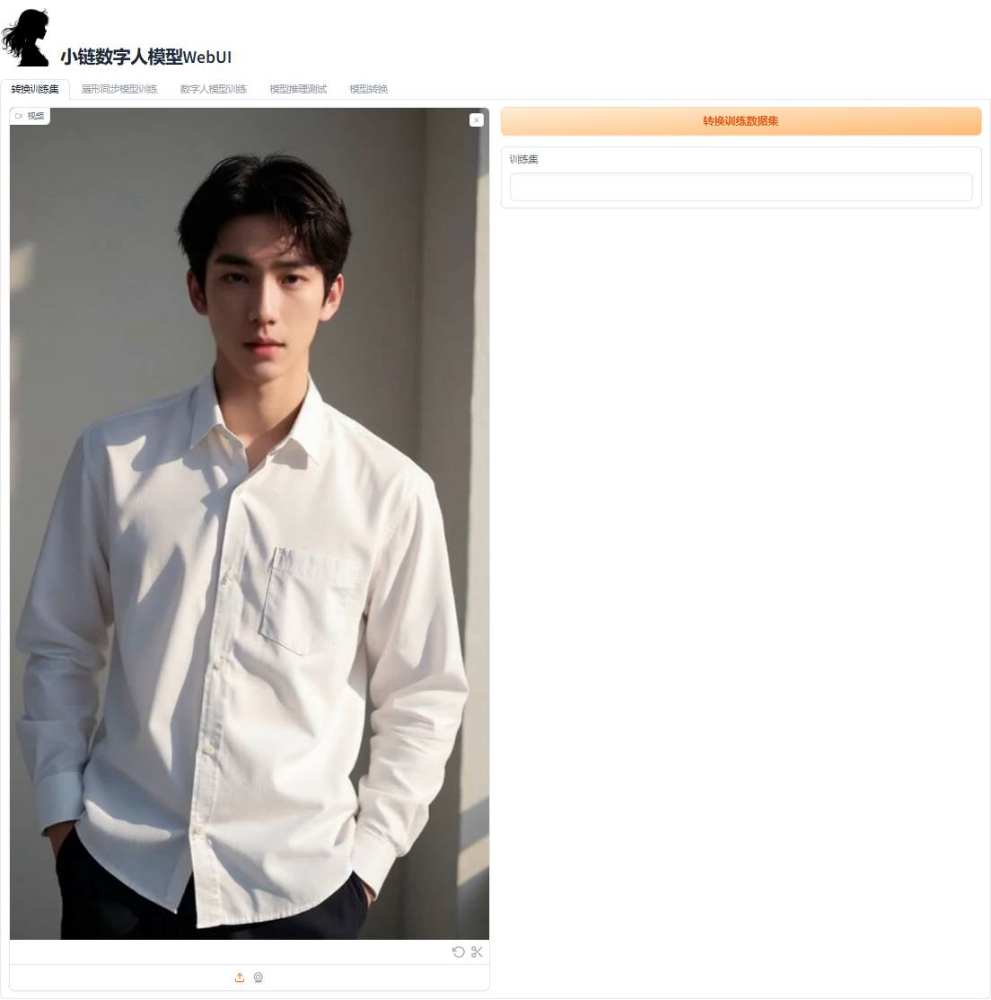
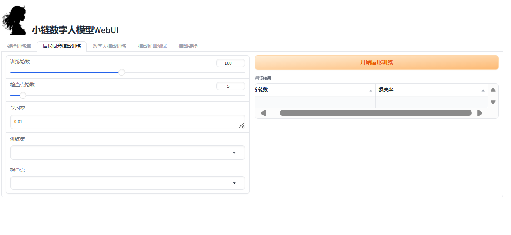
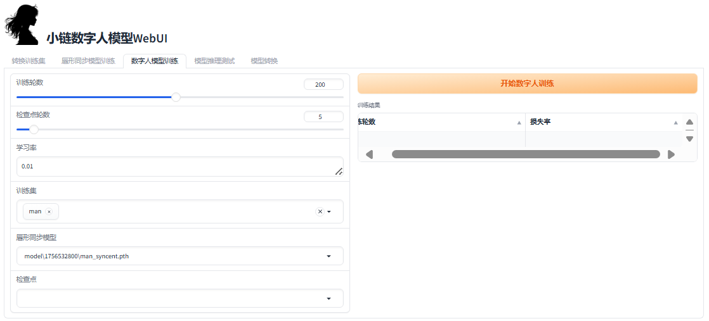
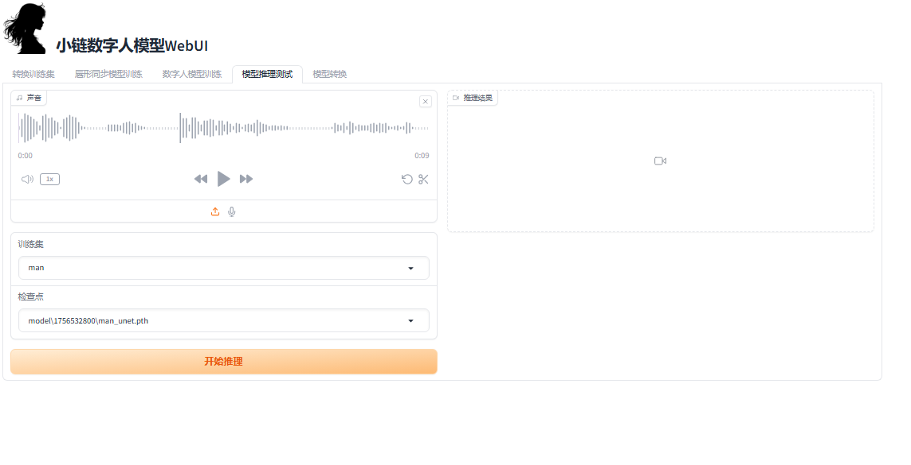
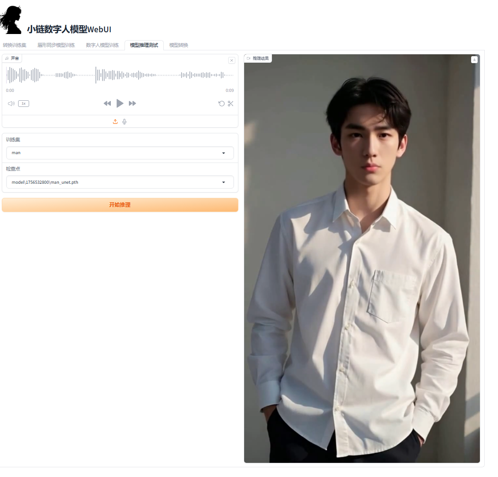
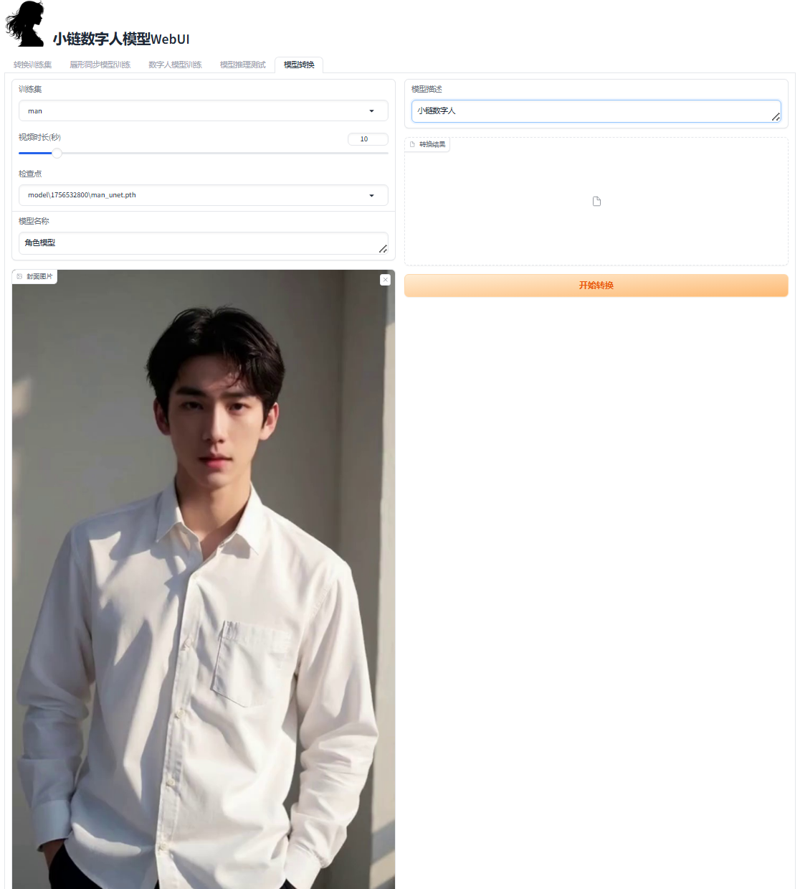
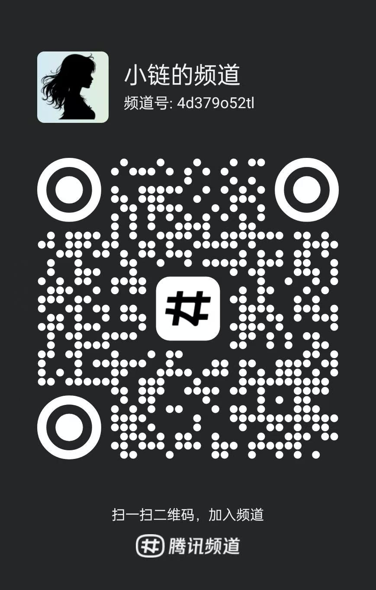

<div align="center">

<h1>小链数字人模型-WebUI</h1>
 <br>
小链数字人模型可以用于移动端的单人数字人模型，通过模型转换功能可直接导入小链APP使用 
 
**小链 [APP](https://chat.finelink.ltd) 下载地址!**
</div>

## 推理效果演示
<video src="https://private-user-images.githubusercontent.com/167196623/483856967-a311efd7-0298-4d95-b8b0-59a38a7ef5ac.mp4?jwt=eyJ0eXAiOiJKV1QiLCJhbGciOiJIUzI1NiJ9.eyJpc3MiOiJnaXRodWIuY29tIiwiYXVkIjoicmF3LmdpdGh1YnVzZXJjb250ZW50LmNvbSIsImtleSI6ImtleTUiLCJleHAiOjE3NTY1MzgzNzQsIm5iZiI6MTc1NjUzODA3NCwicGF0aCI6Ii8xNjcxOTY2MjMvNDgzODU2OTY3LWEzMTFlZmQ3LTAyOTgtNGQ5NS1iOGIwLTU5YTM4YTdlZjVhYy5tcDQ_WC1BbXotQWxnb3JpdGhtPUFXUzQtSE1BQy1TSEEyNTYmWC1BbXotQ3JlZGVudGlhbD1BS0lBVkNPRFlMU0E1M1BRSzRaQSUyRjIwMjUwODMwJTJGdXMtZWFzdC0xJTJGczMlMkZhd3M0X3JlcXVlc3QmWC1BbXotRGF0ZT0yMDI1MDgzMFQwNzE0MzRaJlgtQW16LUV4cGlyZXM9MzAwJlgtQW16LVNpZ25hdHVyZT01OGIxMTdjZTA1YWFiZTQzMDY5MmM1N2Y2YmZhMDljNjU2NWYxNmE5Y2NhZWUxNDljM2Q3MzQ4NTg2MjUyOTE2JlgtQW16LVNpZ25lZEhlYWRlcnM9aG9zdCJ9.gzOK1y6sYKbziXe09OGgvOzeAx4-aOK6_LF8E0gTUrQ" width="320" height="240" controls preload></video>

## 使用教程
### 下载项目后在项目目录执行环境安装,

1. 最低硬件要求:6G以上显存Nvidia显卡
2. 软件环境要求：torch2.0+ CUDA12.1+ ffmpeg

```bash
conda create -n digitalHuman python=3.10
conda activate digitalHuman
pip install -r requirements.txt
```

### 启动 WebUI
```bash
python webui.py
```
#### 转换训练数据
用于转换模型训练数据集
1. 在**转换训练集**Tab上传单人口播视频文件(确保所有帧都包含无遮挡的人脸)

2. 点击**转换训练数据集**按钮，等待转换完成(完成后会在其他Tab训练集中出现)

#### 唇型同步模型训练
用于训练唇形同步模型
1. 切换到**唇形同步模型训练**Tab选择刚刚转换好的数据集，设置好训练参数
   - 训练轮数：训练多少轮，保持默认100次即可
   - 学习率：首次0.001即可，继续训练超过100轮的检查点，建议改为0.0001
   - 检查点轮数：多少论保持一次结果，间隔太小会保存太多文件，已经自动保存最低loss
   - 训练集：之前一个Tab转换的训练集都会出现在此，选择需要训练的数据，数据集大小建议3到5分钟
   - 检查点：第一次可以忽略，训练结果中断或者对之前训练模型部满意，可以选择之前保持的检查点继续训练

2. 点击**开始唇形训练**按钮开始训练，等待完成即可
   - 完成后会输出检查点轮数对应的loss，以及最佳损失率，建议损失率小于9.xxxxxxxxxe-06


#### 数字人模型训练
用于训练数字人模型
1. 切换到**数字人模型训练**Tab选择对应的训练集，和检查点
    - 训练轮数：训练多少轮，保持默认200次即可
    - 学习率：首次0.001即可，继续训练超过100轮的检查点，建议改为0.0001
    - 检查点轮数：多少论保持一次结果，间隔太小会保存太多文件，已经自动保存最低损失率
    - 训练集：之前一个Tab转换的训练集都会出现在此，选择需要训练的数据，数据集大小建议3到5分钟
    - 唇形同步模型：**唇形同步模型训练**训练的结果，选择最小损失的模型即可
    - 检查点：第一次可以忽略，训练结果中断或者对之前训练模型部满意，可以选择之前保持
    的检查点继续训练
    
2. 点击**开始数字人训练**按钮开始训练，等待完成即可
   - 完成后会输出检查点轮数对应的loss，以及最佳损失率(训练完成的结果可以在推理测试中验证是否满足要求)
#### 模型推理测试
测试训练数字人模型的效果
1. 切换到**模型推理测试**Tab选择对应的检查点，上传测试音频，选择对应的训练集，选择检查点

2. 点击**开始推理**按钮，等待推理完成
 
#### 模型转换
用于将模型转换为小链APP可用的模型
1. 却换到**模型转换**Tab填写相关参数
    - 训练集：训练集，数字人视频帧生成
    - 视频时长：数字人视频长度，从训练集中切割
    - 检查点：数字人模型检查点
    - 模型名称：小链APP中的显示名称
    - 封面图片：小链APP中显示的封面
    - 模型概述：小链APP中的模型描述

2. 点击**开始转换**按钮，等待转换完成，下载后拷贝到手机可以通过小链APP的本地导入APP

### 有疑问可以来QQ频道直接和我沟通
 
